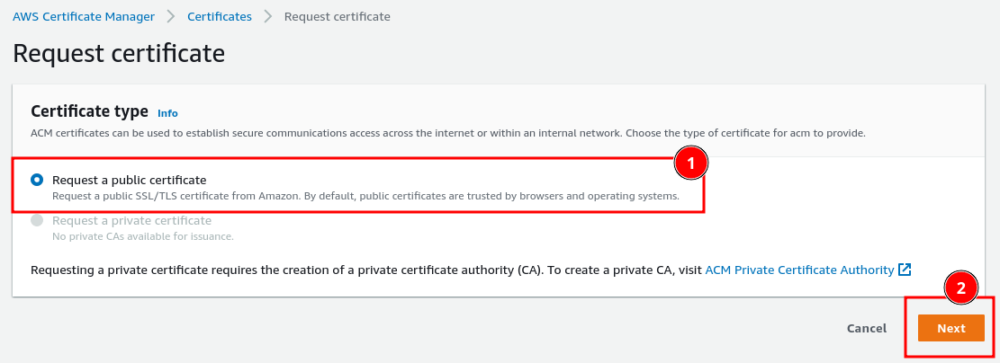
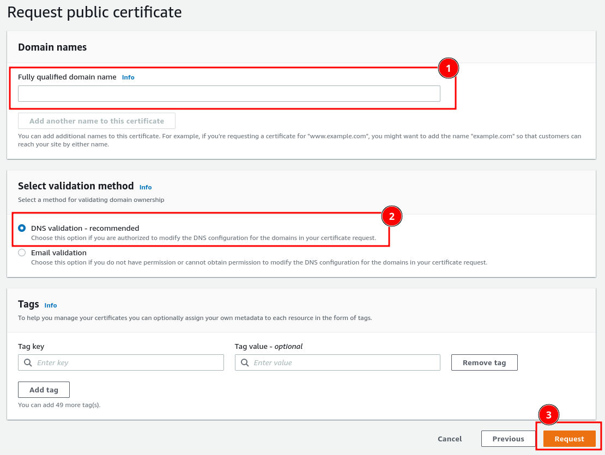
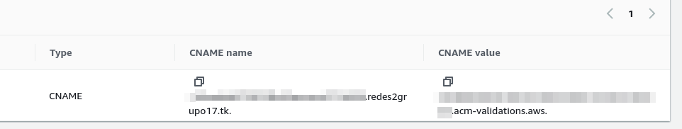
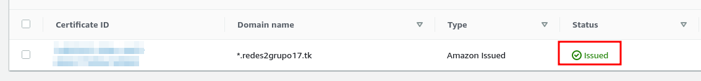

# Manual Técnico

Proyecto

Redes de computadores 2

---

## Grupo 17

Integrantes

|  Carnet   | Nombre                        |
| :-------: | ----------------------------- |
| 200113057 | Mario Augusto Pineda Morales  |
| 201313828 | Bernald Renato Paxtor Peren   |
| 201504051 | Asunción Mariana Sic Sor      |
| 201612101 | Abner Abisai Hernandez Vargas |

# Tabla de Contenido

- [Manual Técnico](#manual-técnico)
  - [Grupo 17](#grupo-17)
- [Tabla de Contenido](#tabla-de-contenido)
- [Servidor](#servidor)
    - [Desarrollo servidor](#desarrollo-servidor)
        - [Insertar registro](#insertar-registro)
        - [Obtener registros](#obtener-registros)
        - [Insertar asistencia](#insertar-asistencia)
        - [Obtener asistencias](#obtener-asistencias)
    - [Dockerfile servidor](#dockerfile-servidor)
- [Base de datos](#base-de-datos)
- [Dominio y configuracion DNS](#dominio-y-configuracion-dns)
- [Certificado HTTPS](#certificado-https)

# Servidor

El [servidor](service/server/app.py) fue desarrollado con una API en Python con Flask

## Desarrollo servidor

Dado que la base de datos se trabaja con MongoDB, primero se importan las librerías necesarias y se enlaza la conexión a la base de datos y colección correspondiente.

```python
# Libreria para conectar con mongoDB
from pymongo import MongoClient
import os

# Conectar a mongo
# se entrega variable de entorno que contiene URI de Mongo
client = MongoClient(os.environ['URI_MONGO'])

# Seleccionar base de datos y coleccion
db = client['redes2']
collection = db.estudiantes
```

### Insertar registro

Para insertar un registro, se utiliza la dirección [`POST/ http://HOST_SERVER:PUERTO/`]() y se entrega como cuerpo la siguiente estructura JSON:

```json
{
  "carnet": "...",
  "nombre": "...",
  "curso": "...",
  "mensaje": "..."
}
```

De esta manera inserta a la colección de mongo en base al siguiente modelo:

```json
{
  "carnet": "...",
  "nombre": "...",
  "curso": "...",
  "mensaje": "...",
  "servidor": "segun variable entorno"
}
```

En dado caso el almacenamiento sea correcto, devuelve la siguiente respuesta:

```json
{
  "server": "SERVER167",
  "status": 200
}
```

Caso contrario,

```json
{
  "server": "SERVER167",
  "status": 403
}
```

> Definición en python
>
> ```python
> @app.route('/', methods=['POST'])
> def ingresar():
>     day = date.today()
>
>     respuesta = collection.insert_one(
>         {
> "carnet": request.json.get('carnet'),
> "nombre": request.json.get('nombre'),
> "curso": request.json.get('curso'),
> "fecha": day.strftime("%d/%m/%Y"),
> "mensaje": request.json.get('mensaje'),
> "servidor": os.environ['SERVER']
> }
> )
> if respuesta: return jsonify({'status': 200, 'server': os.environ['SERVER']})
> else: return jsonify({'status': 403, 'server': os.environ['SERVER'] })
> ```

### Obtener registros

Para obtener los registros de la base de datos, se utiliza la dirección [`PUT/ http:HOST_SERVER:PUERTO/`]()

- Si el cuerpo se entrega vacío, la petición devuelve los registros de **cualquier carnet** en un arreglo tipo JSON

- Si el cuerpo de la petición es

  ```json
  {
    "carnet": "..."
  }
  ```
  entregará como respuesta los registros correspondientes al carnet especificado.

> Definición en Python
>
> ```python
>    @app.route('/', methods=['PUT'])
>    def retornar():
>        carnet = request.json.get('carnet')
>        arr = []
>        res = {}
>
>        if carnet:
>            res = collection.find({"carnet": carnet}, {"_id": False})
>        else:
>            res = collection.find({}, {"_id": False})
>
>        for i in res:
>            arr.append(i)
>
>        return jsonify({"listado": arr, "server": os.environ['SERVER']})
> ```

### Insertar asistencia

Para insertar una nueva asistencia, se utiliza la dirección [`POST/ http://HOST_SERVER:PUERTO/asistencia`]() y se entrega como cuerpo la siguiente estructura JSON:

```json
{
  "carnet": "...",
  "name": "...",
  "eventName": "...",
  "idEvento": "...",
  "image" : "..."
}
```

De esta manera inserta a la colección de mongo en base al siguiente modelo:

```json
{
  "carnet": "...",
  "name": "...",
  "eventName": "...",
  "idEvento": "...",
  "image" : "...",
  "fecha" : "...",
  "servidor": "segun variable entorno"
}
```

En dado caso el almacenamiento sea correcto, devuelve la siguiente respuesta:

```json
{
  "server": "SERVER167",
  "status": 200
}
```

Caso contrario,

```json
{
  "server": "SERVER167",
  "status": 403
}
```

> Definición en python
>
> ```python
> @app.route('/asistencia', methods=['POST'])
> def putAsistencia():
>     image = request.json.get('image')
>     starter = image.find(',')
>     image_data = image[starter+1:]
>     image_data = bytes(image_data, encoding="ascii ")
>     ubicacion = 'redes2/' + str(uuid.uuid1().time_low)
> 
>     s3.upload_fileobj(
>         BytesIO(base64.b64decode(image_data)),
>         BUCKET_NAME,
>         ubicacion,
>         ExtraArgs={'ACL': 'public-read'}
>     )
> 
>     respuesta = collect_asistencia.insert_one({
>         "carnet": request.json.get('carnet'),
>         "name": request.json.get('name'),
>         "eventName": request.json.get('eventName'),
>         "idEvento" : request.json.get('idEvento'),
>         "image": URL_BUCKET + ubicacion,
>         "server": os.environ['SERVER']
>     })
> 
>     if respuesta: return jsonify({'status': 200, 'server': os.environ['SERVER']})
>     else: return jsonify({'status': 403, 'server': os.environ['SERVER'] })
> ```

### Obtener asistencias

Para obtener las asistencias registradas en la base de datos, se utiliza la dirección [`PUT/ http:HOST_SERVER:PUERTO/asistencia`]()

- Si el cuerpo se entrega vacío, la petición devuelve la asistencia de **cualquier carnet** en un arreglo tipo JSON

- Si el cuerpo de la petición es

  ```json
  {
    "carnet": "..."
  }
  ```
  entregará como respuesta las asistencias correspondientes al carnet especificado.

- Si el cuerpo de la petición es

  ```json
  {
    "idEvento": "..."
  }
  ```
  entregará como respuesta las asistencias correspondientes al id del evento especificado.

> Definición en Python
>
> ```python
> @app.route('/asistencia', methods=['PUT'])
> def retornar_asistencia():
>     carnet = request.json.get('carnet')
>     idEvento = request.json.get('idEvento')
> 
>     arr = []
>     res = {}
> 
>     if carnet:
>         res = collect_asistencia.find({"carnet": carnet}, {"_id": False})
> 
>     elif idEvento:
>         res = collect_asistencia.find({"idEvento": idEvento}, {"_id": False})
> 
>     else:
>         res = collect_asistencia.find({}, {"_id": False})
> 
>     for i in res:
>         arr.append(i)
>     
>     return jsonify({"listado": arr, "server": os.environ['SERVER']})
> ```

## Dockerfile servidor

Se construye la [imagen del servidor](service/server/Dockerfile) para posteriormente hacer réplica de él con [docker-compose](#docker-compose)

```Dockerfile
FROM python:alpine3.9
#copiar en /api lo que se encuentra en la raíz del server
COPY . /api
#establecer /api como directorio de trabajao
WORKDIR /api
#actualizar pip
RUN pip install --upgrade pip

#instalar las librerias para levantar la API en Python
RUN pip install flask
RUN pip install flask_cors
RUN pip install pymongo
RUN pip install "pymongo[srv]"
RUN pip install boto3
RUN pip install uuid

#exponer el puerto 7050 del contenedor
EXPOSE 7050
```
# Base de datos
Como motor de base de datos fue usado MongoDB [](img/mongodb_logo_icon.svg), con la [imágen](https://hub.docker.com/_/mongo/) ubicada en docker hub como base.

Para construir el docker container de MongoDB se uso el siguiente archivo docker-compose.yml.

```yaml
version: "3.8"
services:
  mongodb:
    image : mongo
    container_name: mongodb
    environment:
      - PUID=1000
      - PGID=1000
      - MONGO_INITDB_ROOT_USERNAME=grupo17
      - MONGO_INITDB_ROOT_PASSWORD=grupo17
    volumes:
      - ./database:/data/db
    ports:
      - 27017:27017
    restart: unless-stopped
```
Las variables de entorno "MONGO_INITDB_ROOT_USERNAME" y "MONGO_INITDB_ROOT_PASSWORD" fueron usadas para definir el usuario y password para la autentificación al conectarse con la base de datos.
# Dominio y configuracion DNS
Se uso el domininio redes2grupo17.tk, obtenido por medio de la pagina freenom.
Despues de registrado el dominio se procedio a la configuracion de registros DNS, para lo cual fueron usados los siguientes tipos registros:
## A
La "A" significa "address(direccion)" y es el tipo de registro DNS más basico, este indica la dirección IP de un determinado dominio.

Fueron configurados los siguientes 4 registros tipo A:


## CNAME
El registro "canonical name(nombre canónico)" (CNAME) se utiliza en lugar de un registro A, cuando un dominio o subdominio es un alias de otro dominio. Todos los registros CNAME deben apuntar a un dominio, nunca a una dirección IP.

Fueron configurados los siguientes 5 registros tipo CNAME:


# Certificado HTTPS

Dirigirse al apartado de `AWS Certificate Manager` y seleccionar la opción de `Request`, luego indicar `Request a public certificate` y dar clic en `Next`.



Ingresar el nombre del dominio, luego indicar DNS como método de validación y dar clic en `Request`.



Ir al dominio en la página de [freenom.com](freenom.com) en donde se ingresa el `CNAME name` y el `CNAME value` para la validación.



Esperar unos minutos a que la validación sea correcta.

