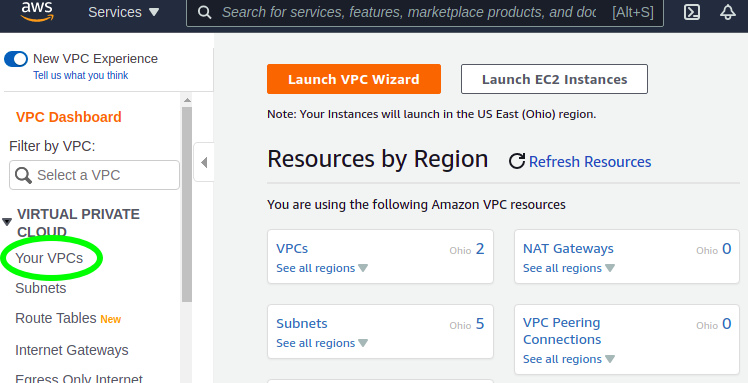
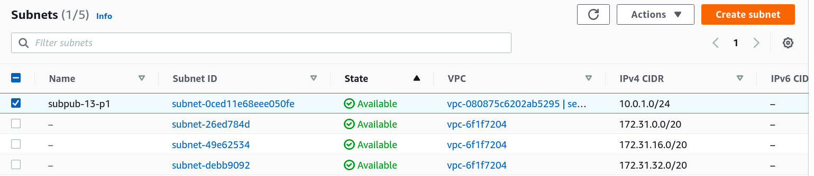
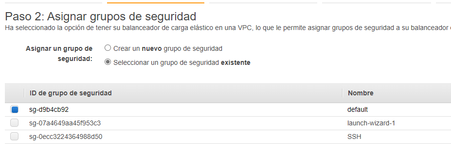

# Manual Técnico

Proyecto

Redes de computadores 2

---

## Grupo 17

Integrantes

|  Carnet   | Nombre                        |
| :-------: | ----------------------------- |
| 200113057 | Mario Augusto Pineda Morales  |
| 201313828 | Bernald Renato Paxtor Peren   |
| 201504051 | Asunción Mariana Sic Sor      |
| 201612101 | Abner Abisai Hernandez Vargas |

# Tabla de Contenido

- [Manual Técnico](#manual-técnico)
  - [Grupo 17](#grupo-17)
- [Tabla de Contenido](#tabla-de-contenido)
- [Servidor](#servidor)
  - [Desarrollo servidor](#desarrollo-servidor)
    - [Insertar registro](#insertar-registro)
    - [Obtener registros](#obtener-registros)
    - [Insertar asistencia](#insertar-asistencia)
    - [Obtener asistencias](#obtener-asistencias)
  - [Dockerfile servidor](#dockerfile-servidor)
- [Base de datos](#base-de-datos)
- [Dominio y configuracion DNS](#dominio-y-configuracion-dns)
- [Certificado HTTPS](#certificado-https)
- [AWS](#aws)

  - [VPC](#vpc)
  - [Subred](#subred)
  - [Tabla de enrutamiento](#tabla-de-enrutamiento)
  - [Grupos de seguridad](#grupos-de-seguridad)
  - [EC2](#ec2)
  - [Balanceador de Carga](#balanceador-de-carga)

  - > [Despliegue](#aws-despliegue)

- [Apéndice](#apéndice)
  - [Buscar servicio en AWS](#buscar-servicio-en-aws)

# Servidor

El [servidor](service/server/app.py) fue desarrollado con una API en Python con Flask

## Desarrollo servidor

Dado que la base de datos se trabaja con MongoDB, primero se importan las librerías necesarias y se enlaza la conexión a la base de datos y colección correspondiente.

```python
# Libreria para conectar con mongoDB
from pymongo import MongoClient
import os

# Conectar a mongo
# se entrega variable de entorno que contiene URI de Mongo
client = MongoClient(os.environ['URI_MONGO'])

# Seleccionar base de datos y coleccion
db = client['redes2']
collection = db.estudiantes
```

### Insertar registro

Para insertar un registro, se utiliza la dirección [`POST/ http://HOST_SERVER:PUERTO/`]() y se entrega como cuerpo la siguiente estructura JSON:

```json
{
  "carnet": "...",
  "nombre": "...",
  "curso": "...",
  "mensaje": "..."
}
```

De esta manera inserta a la colección de mongo en base al siguiente modelo:

```json
{
  "carnet": "...",
  "nombre": "...",
  "curso": "...",
  "mensaje": "...",
  "servidor": "segun variable entorno"
}
```

En dado caso el almacenamiento sea correcto, devuelve la siguiente respuesta:

```json
{
  "server": "SERVER167",
  "status": 200
}
```

Caso contrario,

```json
{
  "server": "SERVER167",
  "status": 403
}
```

> Definición en python
>
> ```python
> @app.route('/', methods=['POST'])
> def ingresar():
>     day = date.today()
>
>     respuesta = collection.insert_one(
>         {
> "carnet": request.json.get('carnet'),
> "nombre": request.json.get('nombre'),
> "curso": request.json.get('curso'),
> "fecha": day.strftime("%d/%m/%Y"),
> "mensaje": request.json.get('mensaje'),
> "servidor": os.environ['SERVER']
> }
> )
> if respuesta: return jsonify({'status': 200, 'server': os.environ['SERVER']})
> else: return jsonify({'status': 403, 'server': os.environ['SERVER'] })
> ```

### Obtener registros

Para obtener los registros de la base de datos, se utiliza la dirección [`PUT/ http:HOST_SERVER:PUERTO/`]()

- Si el cuerpo se entrega vacío, la petición devuelve los registros de **cualquier carnet** en un arreglo tipo JSON

- Si el cuerpo de la petición es

  ```json
  {
    "carnet": "..."
  }
  ```

  entregará como respuesta los registros correspondientes al carnet especificado.

> Definición en Python
>
> ```python
>    @app.route('/', methods=['PUT'])
>    def retornar():
>        carnet = request.json.get('carnet')
>        arr = []
>        res = {}
>
>        if carnet:
>            res = collection.find({"carnet": carnet}, {"_id": False})
>        else:
>            res = collection.find({}, {"_id": False})
>
>        for i in res:
>            arr.append(i)
>
>        return jsonify({"listado": arr, "server": os.environ['SERVER']})
> ```

### Insertar asistencia

Para insertar una nueva asistencia, se utiliza la dirección [`POST/ http://HOST_SERVER:PUERTO/asistencia`]() y se entrega como cuerpo la siguiente estructura JSON:

```json
{
  "carnet": "...",
  "name": "...",
  "eventName": "...",
  "idEvento": "...",
  "image": "..."
}
```

De esta manera inserta a la colección de mongo en base al siguiente modelo:

```json
{
  "carnet": "...",
  "name": "...",
  "eventName": "...",
  "idEvento": "...",
  "image": "...",
  "fecha": "...",
  "servidor": "segun variable entorno"
}
```

En dado caso el almacenamiento sea correcto, devuelve la siguiente respuesta:

```json
{
  "server": "SERVER167",
  "status": 200
}
```

Caso contrario,

```json
{
  "server": "SERVER167",
  "status": 403
}
```

> Definición en python
>
> ```python
> @app.route('/asistencia', methods=['POST'])
> def putAsistencia():
>     image = request.json.get('image')
>     starter = image.find(',')
>     image_data = image[starter+1:]
>     image_data = bytes(image_data, encoding="ascii ")
>     ubicacion = 'redes2/' + str(uuid.uuid1().time_low)
>
>     s3.upload_fileobj(
>         BytesIO(base64.b64decode(image_data)),
>         BUCKET_NAME,
>         ubicacion,
>         ExtraArgs={'ACL': 'public-read'}
>     )
>
>     respuesta = collect_asistencia.insert_one({
>         "carnet": request.json.get('carnet'),
>         "name": request.json.get('name'),
>         "eventName": request.json.get('eventName'),
>         "idEvento" : request.json.get('idEvento'),
>         "image": URL_BUCKET + ubicacion,
>         "server": os.environ['SERVER']
>     })
>
>     if respuesta: return jsonify({'status': 200, 'server': os.environ['SERVER']})
>     else: return jsonify({'status': 403, 'server': os.environ['SERVER'] })
> ```

### Obtener asistencias

Para obtener las asistencias registradas en la base de datos, se utiliza la dirección [`PUT/ http:HOST_SERVER:PUERTO/asistencia`]()

- Si el cuerpo se entrega vacío, la petición devuelve la asistencia de **cualquier carnet** en un arreglo tipo JSON

- Si el cuerpo de la petición es

  ```json
  {
    "carnet": "..."
  }
  ```

  entregará como respuesta las asistencias correspondientes al carnet especificado.

- Si el cuerpo de la petición es

  ```json
  {
    "idEvento": "..."
  }
  ```

  entregará como respuesta las asistencias correspondientes al id del evento especificado.

> Definición en Python
>
> ```python
> @app.route('/asistencia', methods=['PUT'])
> def retornar_asistencia():
>     carnet = request.json.get('carnet')
>     idEvento = request.json.get('idEvento')
>
>     arr = []
>     res = {}
>
>     if carnet:
>         res = collect_asistencia.find({"carnet": carnet}, {"_id": False})
>
>     elif idEvento:
>         res = collect_asistencia.find({"idEvento": idEvento}, {"_id": False})
>
>     else:
>         res = collect_asistencia.find({}, {"_id": False})
>
>     for i in res:
>         arr.append(i)
>
>     return jsonify({"listado": arr, "server": os.environ['SERVER']})
> ```

## Dockerfile servidor

Se construye la [imagen del servidor](service/server/Dockerfile) para posteriormente hacer réplica de él con [docker-compose](#docker-compose)

```Dockerfile
FROM python:alpine3.9
#copiar en /api lo que se encuentra en la raíz del server
COPY . /api
#establecer /api como directorio de trabajao
WORKDIR /api
#actualizar pip
RUN pip install --upgrade pip

#instalar las librerias para levantar la API en Python
RUN pip install flask
RUN pip install flask_cors
RUN pip install pymongo
RUN pip install "pymongo[srv]"
RUN pip install boto3
RUN pip install uuid

#exponer el puerto 7050 del contenedor
EXPOSE 7050
```

# Base de datos

Como motor de base de datos fue usado MongoDB [](img/mongodb_logo_icon.svg), con la [imágen](https://hub.docker.com/_/mongo/) ubicada en docker hub como base.

Para construir el docker container de MongoDB se uso el siguiente archivo docker-compose.yml.

```yaml
version: "3.8"
services:
  mongodb:
    image: mongo
    container_name: mongodb
    environment:
      - PUID=1000
      - PGID=1000
      - MONGO_INITDB_ROOT_USERNAME=grupo17
      - MONGO_INITDB_ROOT_PASSWORD=grupo17
    volumes:
      - ./database:/data/db
    ports:
      - 27017:27017
    restart: unless-stopped
```

Las variables de entorno "MONGO_INITDB_ROOT_USERNAME" y "MONGO_INITDB_ROOT_PASSWORD" fueron usadas para definir el usuario y password para la autentificación al conectarse con la base de datos.

# Dominio y configuracion DNS

Se uso el domininio redes2grupo17.tk, obtenido por medio de la pagina freenom.
Despues de registrado el dominio se procedio a la configuracion de registros DNS, para lo cual fueron usados los siguientes tipos registros:

## A

La "A" significa "address(direccion)" y es el tipo de registro DNS más basico, este indica la dirección IP de un determinado dominio.

Fueron configurados los siguientes 4 registros tipo A:


## CNAME

El registro "canonical name(nombre canónico)" (CNAME) se utiliza en lugar de un registro A, cuando un dominio o subdominio es un alias de otro dominio. Todos los registros CNAME deben apuntar a un dominio, nunca a una dirección IP.

Fueron configurados los siguientes 5 registros tipo CNAME:


# Certificado HTTPS

Dirigirse al apartado de `AWS Certificate Manager` y seleccionar la opción de `Request`, luego indicar `Request a public certificate` y dar clic en `Next`.


Ingresar el nombre del dominio, luego indicar DNS como método de validación y dar clic en `Request`.


Ir al dominio en la página de [freenom.com](freenom.com) en donde se ingresa el `CNAME name` y el `CNAME value` para la validación.


Esperar unos minutos a que la validación sea correcta.


## AWS

### VPC

"Amazon Virtual Private Cloud (Amazon VPC) le permite lanzar recursos de AWS en una red virtual que haya definido. Esta red virtual es muy similar a la red tradicional que usaría en su propio centro de datos, pero con los beneficios que supone utilizar la infraestructura escalable de AWS." (AWS documentación)

[Buscamos](#buscar-servicio-en-aws) el servicio VPC y en el menú vertical izquierdo elegimos _Your VPCs_

[](manuals-images/aws_vpc_yourvpcs.png)

En la esquina superior derecha buscamos el botón _Create VPC_

[](manuals-images/aws_vpc_createvpc.png)

Para el siguiente paso debemos tener claro los siguientes aspectos

- Nombre a asignar (opcional) **(1)**
- Opciones CIDR para IPv4 **(2)** (ej. 10.0.0.0/23 para tener capacidad para 510 hosts)
- Opciones CIDR para IPv6: **(3)**
  - Asignado por Amazon
  - ICDR própio
  - No ICDR IPv6

[](manuals-images/aws_vpc_configuration.png)

Finalmente hacemos click en el botón _Create VPC_ al pie de la página

[](manuals-images/aws_vpc_createvpcbtn.png)

Para efectos del proyecto usamos los siguientes datos

- Nombre: semi1vpc-13-p1
- CIDR IPv4: 10.0.0.0/16
- No ICDR IPv6

Luego de creada nos muestra un resumen de ella y también la podremos ver en el resumen de nuestras VPCs

[](manuals-images/aws_vpc_brief.png)

[](manuals-images/aws_vpc_myvpcs.png)

[volver a Tabla de contenido](#tabla-de-contenido)

### Subred

"un intervalo de direcciones IP en la VPC." (AWS documentación)

[Buscamos](#buscar-servicio-en-aws) el servicio VPC y en el menú vertical izquierdo elegimos _Subnets_

[](manuals-images/aws_vpcsb_subnets.png)

En la esquina superior derecha buscamos el botón _Create subnet_

[](manuals-images/aws_vpcsb_createsubnet.png)

Para el siguiente paso seleccionar la VPC a la que deseamos agregar la subnet, para este caso será la creada previamente

[](manuals-images/aws_vpcsb_selectVPC.png)

Finalmente hacemos click en el botón _Create VPC_ al pie de la página

[](manuals-images/aws_vpcsb_createsubnetbtn.png)

Una vez seleccionada la VPC nos mostrará las opciones a configurar para la subnet

- Nombre **(1)**
- La zona de disponibilidad **(2)**
- Bloque CIDR IPv4 **(3)**

[](manuals-images/aws_vpcsb_configuration.png)

Las zonas de disponibilidad dependeran de las configuraciones de la cuenta

[](manuals-images/aws_vpcsb_availabilityzones.png)

Para efectos de este manual se eligieron los siguientes parámetros:

- Nombre: subpub-13-p1
- Zona de disponibilidad: us-east-2c
- CIDR: 10.0.1.0/24

Luego de creada nos muestra un resumen de ella y también la podremos ver en el resumen de nuestras subnets

[](manuals-images/aws_vpcsb_brief.png)

[](manuals-images/aws_vpcsb_subnetslist.png)

[volver a Tabla de contenido](#tabla-de-contenido)

### Tabla de enrutamiento

"un conjunto de reglas, denominadas rutas, que se utilizan para determinar dónde se dirige el tráfico de red." (AWS Documentación)

[Buscamos](#buscar-servicio-en-aws) el servicio VPC y en el menú vertical izquierdo elegimos _Route Tables_

[](manuals-images/aws_vpcrt_routetables.png)

En la esquina superior derecha buscamos el botón _Create route table_

[](manuals-images/aws_vpcrt_createroutetable.png)

Cada tabla de ruteo está asociada a una VPC, Nos solicitará un nombre **(1)** y deberemos seleccionar la VPC **(2)** acpetamos por medio del botón _Create route table_ al pie de la página (Se le puede asignar un nombre)

[](manuals-images/aws_vpcrt_configuration.png)

[](manuals-images/aws_vpcrt_createroutetablebutton.png)

Para efectos de este manual se eligieron los siguientes parámetros:

- Nombre: rtpub-13-p1
- VPC: semi1vpc-13-p1

Luego de creada nos muestra un resumen de ella; debajo de este resumen asociaremos una subnet a ella en la opción _Subnet associations_

[](manuals-images/aws_vpcrt_sba.png)

Dentro de esta pestaña nos dirigimos hacia _Edit subnet associations_

[](manuals-images/aws_vpcrt_sba_editsba.png)

Veremos una lista de subnets pertenecientes a la VPC donde seleccionaremos **(1)** el checkbox correspondiente a la subnet deseada, aceptamos en el botón _Save association_ **(2)**

[](manuals-images/aws_vpcrt_sba_association.png)

[volver a Tabla de contenido](#tabla-de-contenido)

### Grupos de seguridad

"Un grupo de seguridad funciona como un firewall virtual de la instancia para controlar el tráfico entrante y saliente. Cuando lanza una instancia en una VPC, puede asignar hasta cinco grupos de seguridad a la instancia. Los grupos de seguridad actúan en el ámbito de la instancia, no en el de la subred. Por lo tanto, cada instancia de la subred de su VPC puede asignarse a distintos conjuntos de grupos de seguridad." (AWS Documentación)

[Buscamos](#buscar-servicio-en-aws) el servicio VPC y en el menú vertical buscamos la categoría _Security_ **(1)** izquierdo elegimos _Security groups_ **(2)**

[](manuals-images/aws_vpcsg_vertical.png)

En la esquina superior derecha buscamos el botón _Create security group_

[](manuals-images/aws_vpcsg_createsg.png)

Los detalles básicos que debemos proporcionar son:

- Nombre
- Descripción
- VPC

[](manuals-images/aws_vpcsg_basicdetails.png)

**Tráfico entrante** por defecto en tráfico entrante está deshabilitado por lo que deberemos agregar las relgas necesarias.

[](manuals-images/aws_vpcsg_ir_clear.png)

En el área de _Inbound rules_ elegimos el botón _Add rule_ por cada regla que deseemos agregar.

[](manuals-images/aws_vpcsg_ir_newrule.png)

Podemos configurar manualmente el objeto de la regla o seleccionar un tipo que esté plenamente identificado (esto autollenará los campos necesarios). Usaremos el tipo predefinido para HTTP

El _Source type_ indica el origen de las conexiones que se les permitirá el ingreso

- Custom: donde colocaremos en _Source_ discriminando IPs por medio de segementos de red del tipo 17.0.0.0/8
- Anywhere-IPv4: Cualquier lugar de la red IPv4
- Anywhere-IPv6: Cualquier lugar de la red IPv6
- My IP: Mostrará la IP desde la que estamos estableciendo la conexión hacia AWS en actualmente

[](manuals-images/aws_vpcsg_ir_filledrule.png)

**Tráfico saliente** por defecto el tráfico saliente está permitido a toda la red IPv4, las reglas responden a los mismos criterios de las de entrada.

[](manuals-images/aws_vpcsg_or_newrule.png)

Aceptamos la creación del grupo de seguridad por medio del botón _Create security group_ al pie de la página

[](manuals-images/aws_vpcsg_createsgbtn.png)

[volver a Tabla de contenido](#tabla-de-contenido)

### EC2

Proporciona capacidad informática en la nube segura y de tamaño modificable. Está diseñado para simplificar el uso de la informática en la nube a escala web para los desarrolladores. La sencilla interfaz de servicios web de Amazon EC2 permite obtener y configurar capacidad con una fricción mínima. Proporciona un control completo sobre los recursos informáticos y puede ejecutarse en el entorno informático acreditado de Amazon.

[Buscamos](#buscar-servicio-en-aws) el servicio EC2 y en el menú vertical izquierdo elegimos _Instancias_

[](manuals-images/aws_ec2_li_instances.png)

> Dentro de la administración de Bases de Datos seleccionamos _Launch instances_

[](manuals-images/aws_ec2_li_launchInstances.png)

> para mantenernos en la capa gratuita elegiremos el checkbox _Free tier only_ **(1)** y la imágen base a utilizar, para el presente ejemplo se eligión Ubuto 20.04 **(2)** y se elige por medio del botón _select_ **(3)**

[](manuals-images/aws_ec2_li_ubuntu2004Image.png)

> Elegiremos entonces el tipo de instancia en cuestión de sus características como tipo de procesador, memoria ram, etc, para el presente ejemplo nos hemos manenido nuevamente el una elegible dentro del Free tier **(1)** por lo que la seleccionamos **(2)** y luego avanzamos al siguiente paso por medio de **Next: Configure Instance Details** **(3)**

[](manuals-images/aws_ec2_li_configureInstanceDetails.png)

> Seleccionamos la dimensión del almacenmiento deseado **(1)** y el tipo de almacenamiento **(2)** y luego avanzamos al siguiente paso por medio de **Next: Add Tags** **(3)**

[](manuals-images/aws_ec2_li_addStorage.png)

> En caso de necesitar agregar tags, se hace en este punto, por medio del botón _Add Tag_ **(1)** donde se le asignará el nombre deseado para luego de haber terminado dirigirnos al botón _Next: Configure Security Group_ **(2)**

[](manuals-images/aws_ec2_li_addTags.png)

> A este punto podremos crear un nuevo security group (con configuración estándar) para la instancia específica **(1)** o seleccionar un grupo ya existente en nuestra VPC **(2)** para finalmente pasar al siguiente paso por medio del botón _Review and Launch_**(3)**

[](manuals-images/aws_ec2_li_securityGroup.png)

> Revisamos la configuración detallada y lanzamos la instancia por medio del botón _Launch_**(1)**

[](manuals-images/aws_ec2_li_reviewInstance.png)

> Para asegurarnos de tener acceso a la instancia, y mantener la seguridad, crearemos un keypair seleccionando el tipo **(1)** y un nombre a discreción **(2)** y lo descargamos a nuestro equipo **(3)** para finalizar por medio del botón _Launch Instances_ **(4)**

[](manuals-images/aws_ec2_li_keyPair.png)

[volver a Tabla de contenido](#tabla-de-contenido)

### Balanceador de Carga

Dememos ir a la seccion de EC2, en el apartado de opciones seleccionar balanceador de carga.

[](manuals-images/manual-usuario-opciones-balanceador.png)

Seleccionamos la opcion de crear balanceador de carga

[](manuals-images/manual-usuario-crear-balanceador.png)

Se nos presentara los tipos de balanceadores que tenemos a disposicion en aws, seleccionamos la opcion 'generacion anterior'

[](manuals-images/manual-usuario-balanceador-anterior.png)

colocamos el nombre a nuestro balanceador, ademas seleccionamos las subredes para el balanceador de carga.

[](manuals-images/manual-usuario-balanceador-definirr.png)

Luego asignamos un grupo de seguridad, de no tener uno seleccionamos el default.

[](manuals-images/mmanual-usuario-balanceador-grupo.png)

Configuramos la ruta en la cual el balanceador comprobara el estado de nuestras instancias

[](manuals-images/manual-usuario-balanceador-comprobacion.png)

Agregamos las instancias a nuestro balanceador de carga.

[](manuals-images/manual-usuario-balanceador-instancia.png)

Por ultimo agregamos etiquetas si las necesitamos y le damos en finalizar.

[](manuals-images/manual-usuario-balanceador-ultimo.png)

[volver a Tabla de contenido](#tabla-de-contenido)

### AWS Despliegue

> - Se creó una VPC para el manejo de las conexiones
>   - el CIDR elejido fue 10.10.0.0/16
> - Se crearon 3 subredes
>   - r2publica con CIDR 10.10.1.0/24
>   - r2prvDB con CIDR 10.10.2.0/24 para red base de datos
>   - r2prvBE con CIDR 10.10.3.0/24 para red back end
> - Una tabla de ruteo general para las tres subredes con dos destinos
>   - 10.10.0.0/16
>   - 0.0.0.0/16
> - Se creó 1 security group para la red interna con las siguientes reglas de ingreso de tráfico
>   - IPv4 de tipo TCP puerto 27017 (Base de datos)
>   - IPv4 de tipo TCP puerto 22 (admin SSH)
>   - IPv4 de tipo TCP puerto 7050 (Back End)
>   - IPv4 de tipo ICMP Echo Request
> - Se creó 1 security group (balancerSG) para el balanceador d ecarga con las siguientes reglas
>   - IPv4 de tipo TCP puerto 7050 (Back End)
>   - IPv4 de tipo TCP puerto 22 desde origen 3.144.182.41/32 (SSH admin desde un solo host)
> - Se crearon tres EC2 de la sigueinte manera
>   - 1 - Base de datos y fue asignada a la subred correspondiente
>   - 2 - Back End y fueron asignadas a la subred correspondiente
> - Se creó un balanceador de carga que apunta a ambas instancias de EC para Back End distribuyendo el puerto 7050

[volver a Tabla de contenido](#tabla-de-contenido)

## Apéndice

### Buscar servicio en AWS

En la consola de administración podemos dirigirnos a _Services_ **(1)** o a la _caja de búsqueda_ **(2)** la barra superior donde deberemos elegir el servicio deseado

[](manuals-images/aws_management_console.png)

La primera opción nos desplegará en una lista los servicios disponibles

[](manuals-images/aws_services_button.png)

Pero si conocemos el nombre del servicio deseado usamos la segunda opción que nos hará sugerencias de la búsqueda ingresada, para el ejemplo usamos EC2 como criterio de búsqueda

[](manuals-images/aws_searchbox.png)
